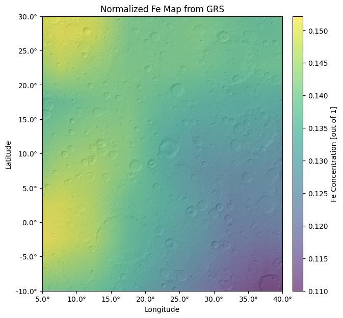
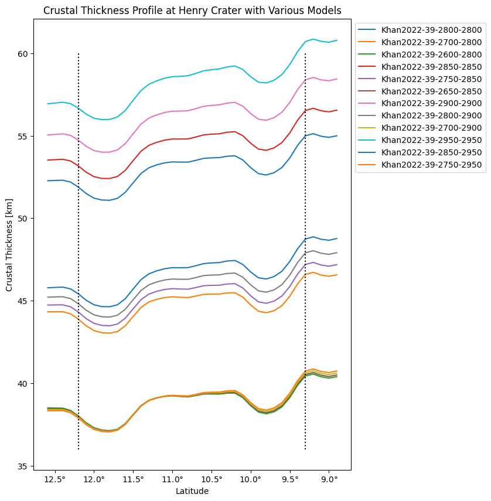

# RedPlanet

RedPlanet makes it easy to work with various Mars datasets and derived quantities in Python. Key features include GRS chemical abundance maps, 22K+ moho/crustal thickness models, heat flow + geothermal gradient models, impact demagnetization calculators, MAVEN magnetometer tracks, and more.

Create publication-ready plots on the fly, or access the underlying data for more involved calculations.

[Get started with an interactive, web-based tutorial on Google Colab](https://drive.google.com/drive/folders/1UxBJzFugjNnjnxebbso7bYJ1cYgEZyzj?usp=sharing).

[Development is ongoing. See [docs/changelog.md](https://github.com/Humboldt-Penguin/redplanet/blob/main/docs/changelog.md) for planned features.]


# Usage:

Install with `pip install redplanet`. 


## GRS

Access/visualize chemical abundance maps derived from the 2001 Mars Odyssey Gamma Ray Spectrometer. More specifically, this is a July 2022 release of the data from [Rani et al.](https://doi.org/https://doi.org/10.1029/2022GL099235) who consolidated three key multivariate methods to create the first unified set of chemical provinces of Mars (including sulfur and aluminum). The data is defined in 5 degree bins, but this module allows you to estimate values at exact coordinates via interpolation. Concentrations can be extracted for both the shallow subsurface (raw data) and bulk crustal composition (normalized to volatile-free basis, i.e. no H2O/Cl/Si).

&nbsp;

### Example 1: 
Iron concentrations in Arabia Terra. Data is normalized to a volatile-free basis (H2O/Cl/Si free), so it is representative of the bulk crustal chemistry. 

<p align="center">
  <a href="https://files.catbox.moe/irjxsp.png">
    <!--  -->
    
  </a>
</p>


Recreate with: 
```python
from redplanet import GRS
GRS.visualize(
  element_name='fe', 
  normalize=True, 
  lon_bounds=(5,40), 
  lat_bounds=(-10,30), 
  grid_spacing=0.1, 
  overlay=True
)
```

&nbsp;

----

## Crust


Access/visualize high-resolution maps of topography, Moho, crustal thickness, and crustal density derived from spherical harmonics. We offer ~22,000 models of the crust-mantle interface from [Wieczorek 2022](https://doi.org/10.5281/zenodo.6477509) (for a summary of models, see [here](https://docs.google.com/spreadsheets/d/1ZDILcSPdbXAFp60VfyC4xTZzdnAVhx_U/edit?usp=sharing&ouid=107564547097010500390&rtpof=true&sd=true)) parameterized by reference interior models, crustal thickness at the InSight landing, and homogeneous/inhomogeneous crustal densities across the dichotomy. 

&nbsp;

### Example 1: 
Topography, Moho, and crustal thickness of outflow channels, Valles Marineris, and Argyre basin. Model parameters are 41 km crustal thickness at the InSight landing, 2,700 kg/m^3 crustal density in the South, and 2,900 kg/m^3 crustal density in the North.

<p align="center">
  <a href="https://files.catbox.moe/tnk9io.png">
    <!--  -->
    
  </a>
</p>


Recreate with:
```python
from redplanet import Crust
lons = (-100,-20)
lats = (-60,40)
Crust.load_model(RIM='Khan2022', insight_thickness=41, rho_north=2900, rho_south=2700)
Crust.visualize(quantity='topo', lon_bounds=lons, lat_bounds=lats, grid_spacing=0.1)
Crust.visualize(quantity='moho', lon_bounds=lons, lat_bounds=lats, overlay=True, grid_spacing=0.3)
Crust.visualize(quantity='thick', lon_bounds=lons, lat_bounds=lats, overlay=True, grid_spacing=0.3)
```

&nbsp;

### Example 2: 
Crustal thickness profile of Henry Crater with various crust-mantle interface models.

<p align="center">
  <a href="https://files.catbox.moe/o10obo.png">
    <!--  -->
    
  </a>
</p>


Recreate with: See section 3.2 in [demo.ipynb](https://github.com/Humboldt-Penguin/redplanet/blob/main/docs/notebooks/demo/demo.ipynb).

&nbsp;

---

# Documentation

<!-- For a more in-depth tutorial in interactive notebook format, see [docs/notebooks/demo/demo.ipynb](docs/notebooks/demo/demo.ipynb). -->
<!-- For a more in-depth tutorial in interactive notebook format, see [redplanet_demo.ipynb](https://drive.google.com/drive/folders/1UxBJzFugjNnjnxebbso7bYJ1cYgEZyzj?usp=sharing). -->

Call `help(module)` or `help(module.method)`. For example:

```python
import redplanet
help(redplanet)
help(redplanet.clear_cache)
from redplanet import GRS
help(GRS)
help(GRS.visualize)
```

Or see the [interactive, web-based tutorial on Google Colab](https://drive.google.com/drive/folders/1UxBJzFugjNnjnxebbso7bYJ1cYgEZyzj?usp=sharing).

&nbsp;

---

# Links

- Don't hesitate to reach out: [zain.eris.kamal@rutgers.edu](mailto:zain.eris.kamal@rutgers.edu)
- PyPI: [pypi.org/project/redplanet/](https://pypi.org/project/redplanet/)
- Changelog + planned features: [docs/changelog.md](https://github.com/Humboldt-Penguin/redplanet/blob/main/docs/changelog.md)
- Acknowledgements: [docs/thanks.txt](https://github.com/Humboldt-Penguin/redplanet/blob/main/docs/thanks.txt)
- References: [docs/references.txt](https://github.com/Humboldt-Penguin/redplanet/blob/main/docs/references.txt)
- Other work: [github.com/Humboldt-Penguin](https://github.com/Humboldt-Penguin)

